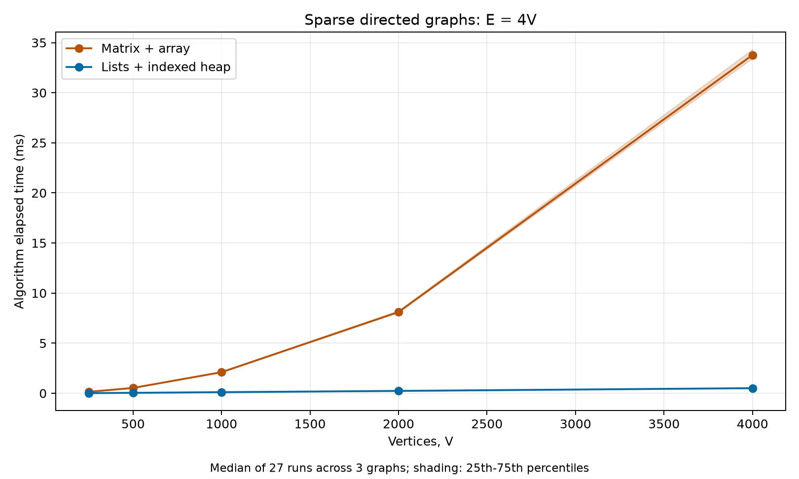
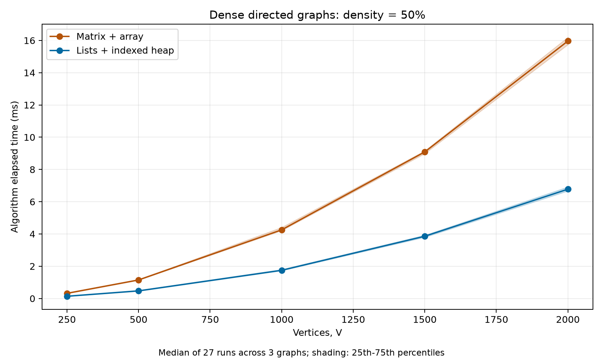
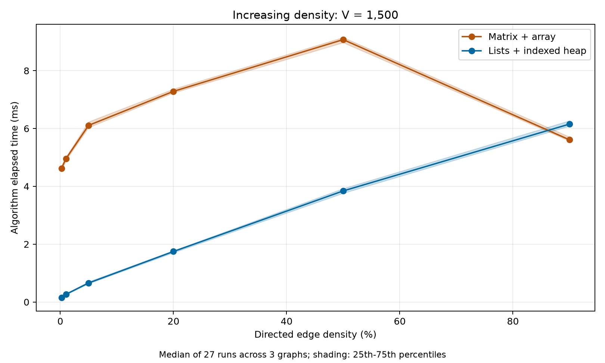

# NTU SC2001 Project 2: slide handoff

## Objectives and scope

Implement and compare (a) Dijkstra using an adjacency matrix and an array priority queue, (b) Dijkstra using an array of adjacency lists and a minimizing heap, and (c) theoretical and empirical performance. This matches the three parts of the supplied Project 2.pdf. No slides have been created. Use this document and the attached measured charts/data to create slides in ChatGPT Work.

C++17 implements the algorithms and timer; Python's standard library handles graph generation and experiment orchestration; Matplotlib produces charts. There are no library shortest-path calls. The indexed binary heap is implemented explicitly in dijkstra.cpp. Both versions return distance and predecessor arrays and support path reconstruction.

## Graph and numeric conventions

- Directed simple graphs, vertices 0..V-1; V must be positive. No parallel arcs or self-loops. E counts ordered arcs. Both directions of an undirected edge would count as two arcs.
- Density = E / [V(V-1)]. The singleton graph has no defined density; it is tested but not benchmarked.
- Matrix entries -1 mean absent; 0 means a real zero-weight edge. Lists store only actual outgoing edges.
- Nonnegative int64 weights. INT64_MAX is the infinity sentinel; finite weights/distances must be <= INT64_MAX-1. Negative and sentinel weights are rejected when Graph is constructed.
- Checked addition rejects an overflowing candidate to an unsettled vertex before adding. This can conservatively reject a graph even if another route has a representable shortest distance. The program reports the error rather than wrapping, saturating, or silently misclassifying a vertex as unreachable.
- Unreachable distance = infinity, predecessor = -1, reconstructed path = empty. Source distance = 0, source path = [source]. Invalid sources are rejected by public algorithm entry points before benchmark timing.
- Only strict improvements update predecessors. Equal-length ties need not produce identical paths; each path must have the correct weight. Zero-weight cycles do not cause predecessor cycles because edges to settled vertices are ignored.

## Implementation and matching pseudocode

### Matrix + array

The distance array together with settled flags is the array priority queue. Every extraction scans unsettled vertices; there is no heap in this version.

```text
MATRIX_ARRAY_CORE(graph, source):
    distance[0..V-1] = infinity; predecessor[0..V-1] = -1
    settled[0..V-1] = false; distance[source] = 0
    repeat at most V times:
        u = -1
        for v = 0..V-1:
            if not settled[v] and (u == -1 or distance[v] < distance[u]):
                u = v
        if u == -1 or distance[u] == infinity: break
        settled[u] = true
        for v = 0..V-1:
            if not settled[v] and matrix[u][v] >= 0:
                candidate = CHECKED_ADD(distance[u], matrix[u][v])
                if candidate < distance[v]:
                    distance[v] = candidate; predecessor[v] = u
    return distance, predecessor
```

### Adjacency lists + indexed binary min-heap

The heap initially contains all vertices once. pos[v] locates v's heap entry; -1 means removed/settled. The heap refers to the distance array for keys. Bottom-up heap construction is O(V); decrease-key uses the updated distance then bubbles that vertex upward. Extraction swaps root and last, removes the last, marks it removed and sifts down. Every swap updates both position entries. There are no duplicate heap entries or lazy outdated entries.

```text
LIST_HEAP_CORE(graph, source):
    distance[0..V-1] = infinity; predecessor[0..V-1] = -1
    distance[source] = 0
    heap = all vertices; initialize pos; bottom-up sift-down heapify
    while heap is not empty:
        u = EXTRACT_MIN(heap)  # pos[u] becomes -1
        if distance[u] == infinity: break
        for (v, weight) in adjacency_list[u]:
            if pos[v] != -1:
                candidate = CHECKED_ADD(distance[u], weight)
                if candidate < distance[v]:
                    distance[v] = candidate; predecessor[v] = u
                    DECREASE_KEY(v):
                        i = pos[v]
                        while i > 0 and distance[heap[i]] < distance[heap[parent(i)]]:
                            swap entries and update both positions
                            i = parent(i)
    return distance, predecessor

EXTRACT_MIN:
    u = heap[0]; swap root with last and update positions
    remove last; pos[u] = -1
    starting at root, repeatedly swap with the child with smaller key
    until heap order holds; update both positions at every swap
    return u

RECONSTRUCT(source, target):
    if distance[target] == infinity: return []
    follow predecessor from target, stopping when source is reached
    reject if more than V vertices are traversed or source is not reached
    reverse and return the collected vertices
```

Dijkstra's invariant: when a finite minimum vertex is extracted, no route through another unsettled vertex can lower it, since unsettled distances are no smaller and edge weights are nonnegative. This remains true for zero weights. Negative edges would invalidate the argument, hence rejection.

## Small demonstration

Use `dijkstra demo` or demo_graph.txt. Source 0; six vertices. Directed arcs:

```text
0 -> 1 (4)     0 -> 2 (0)     2 -> 1 (1)
1 -> 3 (2)     2 -> 3 (5)     3 -> 4 (3)
5 is isolated
```

| Target | Distance | Predecessor | Shortest path |
|---|---:|---:|---|
| 0 | 0 | -1 | 0 |
| 1 | 1 | 2 | 0 -> 2 -> 1 |
| 2 | 0 | 0 | 0 -> 2 |
| 3 | 3 | 1 | 0 -> 2 -> 1 -> 3 |
| 4 | 6 | 3 | 0 -> 2 -> 1 -> 3 -> 4 |
| 5 | infinity | -1 | none |

Extraction sequence for both is 0,2,1,3,4, then termination when no finite key remains. Vertex 1 is first assigned 4 then decreased to 1; vertex 3 is first assigned 5 then decreased to 3. This demonstrates actual decrease-key, a zero-weight edge and an unreachable vertex.

## Theoretical time and space

| Item | Matrix + array | Lists + indexed binary heap |
|---|---|---|
| Graph representation | O(V^2) weights | O(V+E) list headers/edges |
| Working memory, excluding graph | O(V): distances, predecessors, settled flags | O(V): distances, predecessors, heap, positions |
| Total representation + algorithm | O(V^2) | O(V+E) |
| Initialization | O(V) | O(V), including bottom-up heapify |
| Extract minimum | O(V) per extraction | O(log V) per extraction |
| Relaxation traversal | V entries per extracted vertex | Each reachable outgoing edge once |
| Key update | O(1) | O(log V) decrease-key |
| Worst-case algorithm time | O(V^2) | O((V+E) log V) |

Matrix: at most V selections scanning V vertices and V row scans of V entries, so O(V^2) even for a sparse graph. When all vertices are reachable this code performs Theta(V^2) scans. Fewer reachable vertices can reduce the actual work, but not the worst-case bound. The adjacency matrix construction/validation costs O(V^2+E) and is outside algorithm timing.

Heap: O(V) initialization, at most V extractions, E outgoing-edge visits, at most E successful decreases. Thus O(V + E + (V+D) log V), where D is the number of successful decreases, gives the stated O((V+E) log V) worst-case bound (use log(max(2,V)) for the singleton case). D may be much smaller than E, especially in these dense, small-integer-weight graphs; every edge visit does not necessarily trigger a logarithmic update.

For E=O(V), the bounds become O(V^2) versus O(V log V). For E=Theta(V^2), they become O(V^2) versus O(V^2 log V). These are upper bounds, not formulas predicting exact timings or a guaranteed crossover. A dense graph can still favor the heap in real measurements.

Path reconstruction takes O(path length) time and output space, at most O(V). The Bellman-Ford reference takes O(VE) worst-case time and O(V) additional memory, and is used only in small tests.

**Actual harness memory:** Graph deliberately holds both representations plus an edge list for paired tests, so the combined executable uses O(V^2+E) graph memory plus O(V) algorithm workspace. The standalone list representation itself is O(V+E); this harness is not a list-only memory benchmark. At V=4000 the matrix weight payload is 128,000,000 bytes (~122.1 MiB); row headers, allocation overhead, other representations and Python generation add memory. Dense cases stop at V=2000. Peak resident memory was not measured.

## Correctness evidence

The built-in `test` command passed after the final build. It checks the demonstration against explicit distances [0,1,0,3,6,infinity]; empty/disconnected graphs; zero weights; singleton graphs within the random suite; invalid sources, endpoints, negative/sentinel weights, self-loops and duplicate arcs; finite boundary INT64_MAX-1 and overflow at the sentinel boundary.

It also generates 300 deterministic random graphs with 1-18 vertices, variable densities and weights 0..20, and checks every source. Independent Bellman-Ford uses repeated edge relaxation instead of a priority queue. Both distance arrays must match the reference. For every target, reconstructed paths are checked for correct endpoints, valid arcs and matching total weight; unreachable paths must be empty. The test uses explicit exceptions, so checks remain active in optimized builds.

Every large timed result is checked after timing against the matrix baseline and its paths are checked. That paired large-graph check alone is not an independent oracle; the independent evidence comes from Bellman-Ford on the small suite.

The runnable `benchmark.py --check` also passed generated edge-count, unique-arc, endpoint/weight, seed-reproducibility and timer-integration checks, including a cycle-only and a complete directed graph. It runs the C++ correctness suite as well.

Lab 1 also passed a smoke check: Python hybrid/merge sorts matched sorted(), preserved the original array, and successfully plotted a two-array benchmark after relocation. Its historical charts remain intact. The optional Lab 1 C++ backend was not smoke-tested.

## Experiment methodology and machine

Measured on 2026-10-02. Windows 11 (10.0.26200), Intel Core i7-12700KF, 20 logical processors, 34,164,097,024 bytes physical RAM (~31.8 GiB). GCC 14.2.0, MinGW-W64 x86_64-ucrt-posix-seh; flags `-O2 -std=c++17 -Wall -Wextra -static`. Single-threaded C++ algorithms; benchmark orchestration Python 3.12.14; plotting Python 3.13.6 / Matplotlib 3.11.1. See machine.json for the recorded details.

- Sparse scaling: V=250,500,1000,2000,4000, E=4V.
- Dense scaling: V=250,500,1000,1500,2000, density=50%.
- Fixed V=1500: densities 0.2%,1%,5%,20%,50%,90%.
- Three graphs per configuration, seeds 2001,2002,2003. Python Random is used; sorted edge identifiers make list traversal deterministic. Source is also deterministically generated and recorded in CSV.
- Each graph contains a directed Hamiltonian cycle, so every source reaches every vertex; remaining arcs are random without replacement. This is a random ensemble conditioned to contain that cycle, not an unconstrained uniform sample of all graphs of that size. Integer weights uniformly 0..100 include zero.
- Both algorithms receive identical graphs and sources. Two untimed warm-up pairs, then nine measured pairs per graph. Trial parity alternates execution order. Nine is odd: matrix runs first in five trials and heap in four, a small remaining imbalance.
- Total: 16 configurations x 3 graphs x 9 trials x 2 algorithms = 864 samples. Each plotted point pools 27 samples per algorithm from three graphs; median and inclusive 25th/75th percentiles are reported. The IQR combines graph variation and run variation; it is not a confidence interval.
- Timer: std::chrono::steady_clock elapsed milliseconds, **not CPU time**. Timer starts immediately before the validated algorithm core call and stops immediately after return. Working-memory allocation and initialization are included. Representation generation/conversion, input/source validation, graph-file I/O, subprocess startup, CSV writing, correctness/path checks, result destruction and plotting are excluded. Overflow checks inside relaxation remain part of the algorithm.
- Both representations remain in memory; warm caches, background desktop activity, CPU scheduling/frequency changes and allocator behavior can affect elapsed time. No core affinity, performance counters or cache profiling were used. The experiment is an educational comparison on this machine, not a universal hardware benchmark.

## Actual measurements

The tables below are generated from summary.csv. Values are elapsed milliseconds, shown as median [Q1, Q3]; 27 samples per algorithm per point. The CSV retains higher precision and min/max.

### Sparse scaling: E=4V

| V | E | Density | Matrix + array | Lists + indexed heap |
|---:|---:|---:|---:|---:|
| 250 | 1000 | 1.61% | 0.1457 [0.1443, 0.1507] | 0.0162 [0.0126, 0.0184] |
| 500 | 2000 | 0.80% | 0.5336 [0.5304, 0.5377] | 0.0460 [0.0369, 0.0483] |
| 1000 | 4000 | 0.40% | 2.1061 [2.0833, 2.1311] | 0.1121 [0.0943, 0.1148] |
| 2000 | 8000 | 0.20% | 8.1115 [8.0642, 8.2359] | 0.2381 [0.2173, 0.2416] |
| 4000 | 16000 | 0.10% | 33.7650 [33.4324, 34.3231] | 0.5099 [0.4979, 0.5266] |

### Dense scaling: 50% density

| V | E | Density | Matrix + array | Lists + indexed heap |
|---:|---:|---:|---:|---:|
| 250 | 31125 | 50.00% | 0.3209 [0.3084, 0.3312] | 0.1391 [0.1359, 0.1457] |
| 500 | 124750 | 50.00% | 1.1501 [1.1410, 1.1713] | 0.4730 [0.4615, 0.4962] |
| 1000 | 499500 | 50.00% | 4.2568 [4.2140, 4.4066] | 1.7486 [1.7306, 1.7978] |
| 1500 | 1124250 | 50.00% | 9.0895 [8.9872, 9.1556] | 3.8608 [3.7996, 3.9230] |
| 2000 | 1999000 | 50.00% | 15.9632 [15.7435, 16.1976] | 6.7781 [6.6711, 6.9174] |

### Fixed V=1500: increasing density

| V | E | Density | Matrix + array | Lists + indexed heap |
|---:|---:|---:|---:|---:|
| 1500 | 4497 | 0.20% | 4.6203 [4.5077, 4.6933] | 0.1569 [0.1406, 0.1641] |
| 1500 | 22485 | 1.00% | 4.9593 [4.9041, 5.0084] | 0.2674 [0.2500, 0.2736] |
| 1500 | 112425 | 5.00% | 6.1090 [6.0347, 6.2311] | 0.6579 [0.6377, 0.7007] |
| 1500 | 449700 | 20.00% | 7.2852 [7.2340, 7.3648] | 1.7476 [1.7079, 1.7738] |
| 1500 | 1124250 | 50.00% | 9.0747 [8.9724, 9.1492] | 3.8420 [3.7649, 3.9231] |
| 1500 | 2023650 | 90.00% | 5.6090 [5.5680, 5.7077] | 6.1538 [6.0862, 6.2691] |

## Charts and evidence-based interpretation

### sparse_v.png



With E=4V, the matrix median grows from 0.1457 ms at V=250 to 33.7650 ms at V=4000, while the heap grows from 0.0162 to 0.5099 ms. The heap is about 66.2 times faster at V=4000. Doubling V from 2000 to 4000 multiplies matrix time by about 4.16 and heap time by about 2.14. This supports the expected sparse-graph scaling advantage of lists and a heap. It does not prove an asymptotic bound by measurement alone. The heap curve appears close to the horizontal axis because both share a linear y-axis; consult the table for the small values.

### dense_v.png



At 50% density the heap wins at every tested V. At V=2000, medians are 15.9632 ms (matrix) and 6.7781 ms (heap), about 2.36 times faster for the heap. Dense-graph upper bounds alone would suggest an advantage for the matrix at sufficiently large workloads, but this tested size/weight range does not show that crossover at 50% density. Scanning edges without a successful improvement does not pay a decrease-key cost; the heap worst-case logarithmic bound is not necessarily tight on these inputs.

### density.png



At V=1500, increasing E raises heap time from 0.1569 ms at 0.2% density to 6.1538 ms at 90%. The matrix still scans the same V-by-V structure but its elapsed time is not constant: 4.6203, 4.9593, 6.1090, 7.2852, 9.0747 and 5.6090 ms across the six densities. At 50% the heap is about 2.36 times faster; at 90% the matrix is about 1.10 times faster. At 90%, the matrix IQR [5.5681,5.7077] is below the heap IQR [6.0862,6.2691], although these quartiles are not a statistical significance test.

The matrix drop at 90% density is an observed result, not a typo or smoothed theory curve. A plausible explanation is that the edge-presence branch becomes more predictable when almost every entry is an edge; the weight distribution and settlement order may also matter. These are hypotheses: no branch counters or profiling were collected. Big-O bounds do not assert monotonic elapsed time as E changes. The 50%-density V=1500 point is measured separately in two sweeps using the same graph seeds; its small timing differences reflect separate runs, not different graphs.

## Conclusions and limitations

1. Prefer adjacency lists and the indexed heap for the tested sparse graphs: the time and representation-storage advantages are substantial. At fixed average out-degree, matrix row/queue scans still grow quadratically.
2. For very dense graphs, the matrix/array version is competitive and was faster at the tested 90% density. It has fewer data structures and its O(V^2) dense worst-case bound is better than the heap's O(V^2 log V) upper bound. At 50% density, however, the heap remained faster for every tested V.
3. There is no universally faster implementation. Graph density, V, weights, successful relaxation count, memory layout, compiler and hardware affect the outcome. These measurements locate a change of winner between the tested 50% and 90% points for V=1500; they do not identify the exact crossover or establish one for other V.
4. Three graph seeds provide limited ensemble coverage; repeated trials are correlated through shared graphs and warmed memory. Sparse benchmark graphs are all reachable, while disconnected behavior is covered by correctness tests rather than performance experiments. All weights are small integers including zero; different weight distributions may change results.
5. Memory comparisons are theoretical payload/storage analyses, not measured peak memory. The paired harness keeps both graph representations simultaneously. End-to-end construction/conversion time is deliberately excluded; applications that rebuild graphs often may have different tradeoffs. Very small sub-millisecond points are more sensitive to timer/scheduling noise.

## Likely TA questions

| Question | Concise answer |
|---|---|
| Where is the array priority queue? | The distance array and settled flags; extract-min scans all unsettled vertices every iteration. |
| Why does the matrix version take O(V^2) on sparse graphs? | It scans V queue candidates and V row entries per extraction regardless of the number of actual edges. |
| Is the heap an indexed heap or a heap of duplicate entries? | Indexed: one entry per vertex, positions updated on every swap, and explicit decrease-key. |
| Why does decrease-key take O(log V)? | A lowered key moves up at most the height of a binary heap. Position lookup is O(1). |
| Why include V in the heap time bound? | Initializing V vertices and extracting up to V vertices costs time even beyond scanning E edges. |
| Does every edge cause a heap update? | No. Every reachable edge is visited, but only a strict improvement to an unsettled vertex causes decrease-key. |
| Can weights be zero? | Yes. -1 denotes no matrix edge, so zero is not confused with absence. |
| Why reject negative weights? | A settled minimum can later be improved through a negative edge, invalidating Dijkstra's invariant. |
| What happens when vertices are disconnected? | Stop when the minimum key is infinity; leave their distances infinite and paths empty. |
| What happens on distance overflow? | Checked addition throws before an explored candidate exceeds INT64_MAX-1; the error is conservative and never wraps. |
| Do the returned predecessors have to match? | No. Ties may yield different equally short paths; tests verify path validity and total weight. |
| What is the independent correctness oracle? | Bellman-Ford on 300 small random graphs, all sources, plus explicit demo and boundary cases. |
| Are generation and conversion timed? | No. Graph generation, representation construction, validation, output and plotting are outside the core steady-clock interval. |
| Is the measurement CPU time? | No, elapsed wall time measured by steady_clock; scheduling delays may be included. |
| Are algorithm allocations included? | Yes, working vectors and heap initialization/allocation; graph allocations and returned-result destruction are excluded. |
| Why use the same graph and source? | To ensure differences arise from implementations rather than different graph workloads. |
| Why warm up and alternate order? | To reduce cold-start and ordering effects; odd trial count leaves a slight 5-versus-4 first-run imbalance. |
| What does the shading mean? | Pooled 25th-75th percentiles across three graphs and nine trials, not a confidence interval. |
| Why was the heap faster on 50%-dense graphs? | Its upper bound need not be tight; successful decreases can be much fewer than E. Constants and layout matter. |
| Why did matrix time drop at 90% density? | It was measured. Branch predictability is a plausible hypothesis, but we did not profile to establish the cause. |
| Is the adjacency-list implementation really O(V+E) space here? | Its own representation is; this comparison driver retains both representations, giving O(V^2+E) total graph storage. |
| Is a directed cycle an unbiased random graph sample? | No. It guarantees reachability and conditions the ensemble; this limitation is stated. |
| What would you investigate next? | More seeds, intermediate densities, other weight distributions and disconnected performance; profile before attributing causes. |

## Suggested slide narrative and uploads

Use objectives/conventions, demonstration, matrix pseudocode, indexed-heap pseudocode, complexity, correctness evidence, methodology, one slide per chart, then conclusions/limitations. Do not invent extra measurements or present inferred branch behavior as established fact.

Upload SLIDES_HANDOFF.md, sparse_v.png, dense_v.png, density.png, results.csv, summary.csv and machine.json. Also upload dijkstra.cpp, benchmark.py, plot.py, README.md and demo_graph.txt if Work should inspect implementation details. The original Project 2.pdf can be supplied separately from Downloads. No executable or Lab 1 files are needed for slide creation.
